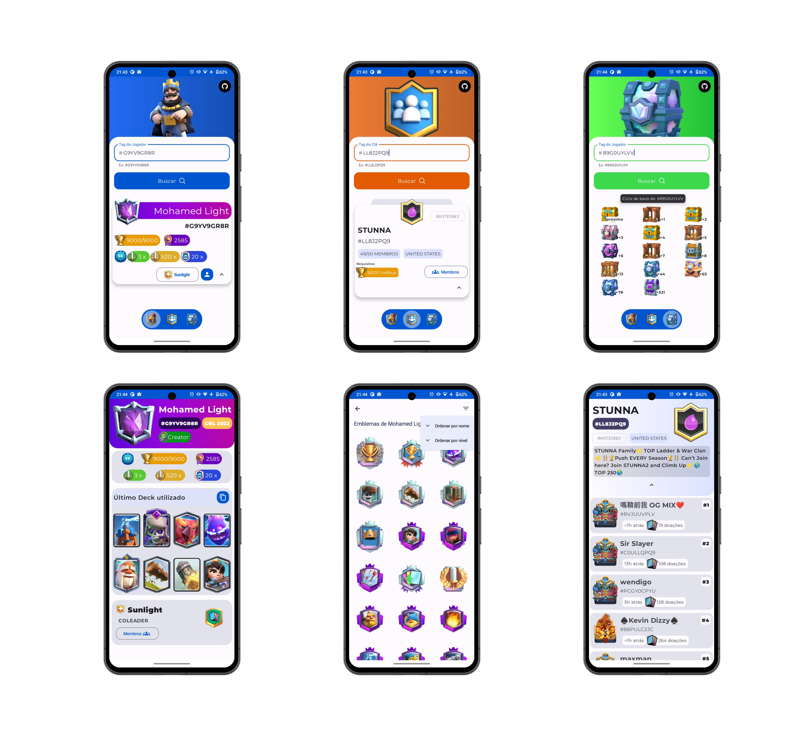

# Stone Royale

### Visão Geral

Aplição contruída em Kotlin, Jetpack Compose e MD3. O app consome a API do [Clash Royale](https://developer.clashroyale.com/#/).

Explorei alguns endpoints da API e utilizei recursos do como:

   - Jetpack Compose
   - Shared Element Transitions (API experimental)
   - Navigation
   ---
   - Coroutines
   - Retrofit
   ----
   - UI State
   - StateFlow
   - View Model
   - --
   - Coil
   - GSON

### Setup

Antes de começar voce precisa confurar sua chave de API no arquivo `local.properties`.

#### `TOKEN_CR={"MY_API_KEY"}`

_Substitua *"MY_API_KEY"* pela sua chave_ 

## Como gerar minha chave de API ?

**ps: todo o processo é gratuito**

  1. Primeiro você deve consultar o site do 
[Royale API](https://docs.royaleapi.com/proxy.html) para pegar o **IP PÚBLICO** (necessário para as proximas etapas)

  2. Em seguida cadastre-se no site do [Clash Royale Developer](https://developer.clashroyale.com/#/) e use seu IP para criar a chave de API. E pronto! É so adicionar no `local.properties` e aproveitar.

### (Bônus) Onde conseguir assets visuais e sonoros

  Acesse o github do Royale api e desfrute de todos os assest: https://github.com/RoyaleAPI/cr-api-assets